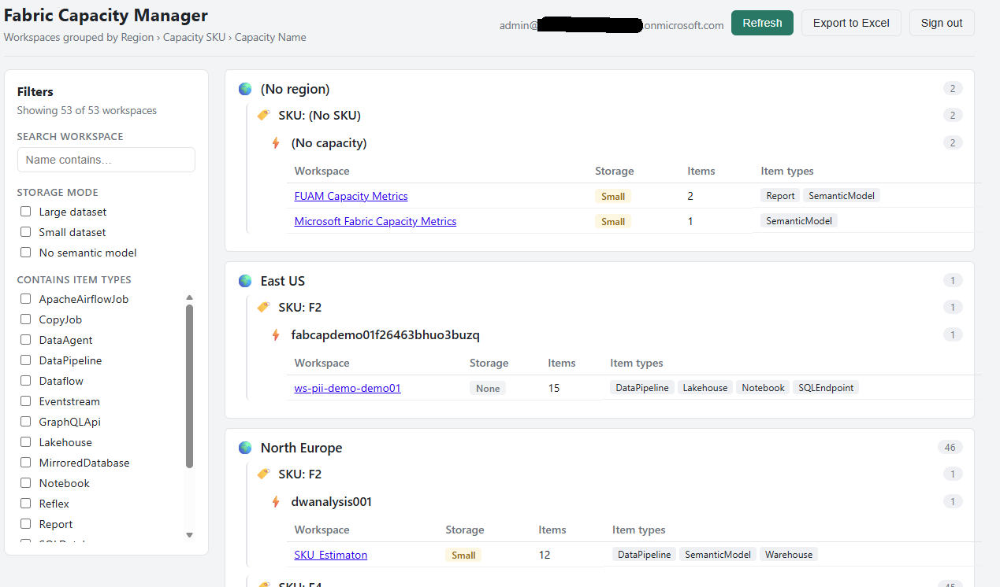

# Fabric Capacity Manager

[](./LICENSE)

A **local dev-mode single-page app** that signs in to a Microsoft Fabric tenant
with an OAuth web dialog (MSAL popup) and lists all workspaces you have access
to, grouped by:

**Region › Capacity SKU › Capacity Name**

<p align="center">
  
</p>

You can filter the workspaces by:

- **Storage mode**: Large dataset / Small dataset / No semantic model
  (derived from each semantic model's `targetStorageMode`).
- **Item presence**: show only workspaces that contain selected Fabric item
  types (Warehouse, Lakehouse, Eventhouse, KQL Database, Notebook, etc.).
- **Name search**.

## Features

The app is organized into three tabs:

- **Dashboard**: a tenant-wide, aggregated overview: KPI cards (workspaces,
  capacities with running/paused split, items, regions, SKUs, estimated monthly
  compute cost, actual billed cost over the last 28 days and OneLake storage)
  plus distribution bars by region, SKU, storage mode and item type.
- **Detail**: the grouped **Region › Capacity SKU › Capacity Name** tree with
  per-workspace storage mode, item types, role, assignment state, optional
  estimated monthly cost, actual billed cost (28d), capacity uptime (28d) and
  OneLake storage pills, **Export to Excel**, and (when enabled) **Admin Mode**
  capacity operations.
- **Configuration**: sign in/out, display **currency** for cost estimates, and
  the opt-in **OneLake storage** integration.

Additional capabilities:

- **Cost estimates**: estimated monthly pay-as-you-go compute cost per
  capacity and region, sourced from the public **Azure Retail Prices API** in
  your selected currency.
- **Actual billed cost (opt-in)**: real pre-tax compute cost billed per capacity
  over the trailing 28 days, queried from the **Azure Cost Management** query
  API. Surfaced as a pill next to the estimate and aggregated on the Dashboard.
  Best-effort: requires ARM access (live writes) and the Cost Management Reader
  role; degrades silently when unavailable.
- **Capacity uptime (opt-in)**: percentage of the trailing 28 days each capacity
  was running, reconstructed from **Azure Activity Log** suspend/resume events.
  Best-effort: requires ARM access (live writes); degrades silently when
  unavailable.
- **OneLake storage (opt-in)**: current and billable OneLake storage per
  workspace, queried from the **Microsoft Fabric Capacity Metrics** app semantic
  model via the Power BI `executeQueries` (DAX) API. Auto-discovers the model,
  supports a custom `EVALUATE` query, and can display the raw query results.
- **Admin Mode**: gated capacity operations: scale, pause/resume, and moving a
  workspace to another capacity in the same geography. Runs validation against a
  local simulation by default; opt in to live writes (see below).
- **Export to Excel**: download the loaded workspaces as a spreadsheet.

## Tech stack

- Vite + React + TypeScript
- `@azure/msal-browser` + `@azure/msal-react` for delegated (user) auth
- Fabric REST API (`api.fabric.microsoft.com`) for workspaces, items, capacities
- Power BI REST API (`api.powerbi.com`) for semantic-model storage mode and
  (opt-in) OneLake storage via the Capacity Metrics model `executeQueries` API
- Azure Retail Prices API (`prices.azure.com`) for capacity cost estimates
- Azure Resource Manager + Fabric write APIs for optional live Admin Mode
- Azure Resource Manager Activity Log and Cost Management query APIs for
  optional capacity uptime and actual billed cost

## 1. Register an Entra application (one-time)

> 📘 For a detailed, link-by-link walkthrough (app registration, redirect URI,
> delegated permissions, admin consent and tenant settings) see
> **[QUICKSTART.md](QUICKSTART.md)**.

1. Go to **Microsoft Entra admin center › App registrations › New registration**.
2. Name it e.g. `Fabric Capacity Manager (dev)`.
3. Supported account types: **Accounts in this organizational directory only**.
4. **Redirect URI** → platform **Single-page application (SPA)** →
   `http://localhost:5173`.
5. Register, then copy the **Application (client) ID** and **Directory (tenant) ID**.
6. Under **API permissions › Add a permission**, add delegated permissions:
   - **Power BI Service**: `Workspace.Read.All`, `Dataset.Read.All`,
     `Capacity.Read.All`
   - **Microsoft Fabric** (Power Platform Fabric API): `Workspace.Read.All`,
     `Item.Read.All`, `Capacity.Read.All`
   - Click **Grant admin consent** (or consent on first sign-in).

> Tenant admins must also enable **"Service principals/users can use Fabric APIs"**
> and Power BI **"Allow user access to REST APIs"** in the tenant admin settings.

## 2. Configure the app

```powershell
copy .env.example .env
```

Edit `.env`:

```
VITE_AAD_CLIENT_ID=<your application (client) id>
VITE_AAD_TENANT_ID=<your directory (tenant) id>
```

### Optional: enable live Admin Mode writes

By default, Admin Mode operations (scale, pause/resume, workspace move) run
real validation but execute against a local **simulation**. To make them issue
real management-plane calls, set:

```
VITE_ADMIN_LIVE_WRITES=true
```

Live writes hit two control planes and require extra permissions:

| Operation | Plane | Endpoint | Permission |
| --- | --- | --- | --- |
| Scale | Azure Resource Manager | `PATCH Microsoft.Fabric/capacities` (sku) | `Microsoft.Fabric/capacities/write` |
| Pause / Resume | Azure Resource Manager | `POST .../suspend` · `.../resume` | `.../suspend/action` · `.../resume/action` |
| Workspace move | Fabric REST | `POST /v1/workspaces/{id}/assignToCapacity` | Workspace admin + capacity contributor |

In the Entra app registration, also add and admin-consent the delegated
permissions **Azure Service Management → user_impersonation** and Fabric
**`Capacity.ReadWrite.All`**, **`Workspace.ReadWrite.All`**. The signed-in user
must hold the RBAC actions above on the target capacities (a custom role scoped
to those four `Microsoft.Fabric/capacities` actions is sufficient).

## 3. Run locally

```powershell
npm install
npm run dev
```

Open <http://localhost:5173>, click **Sign in**, complete the popup, then
**Load workspaces**.

> The dev server port (`5173`) must match the SPA redirect URI you registered.
> To change it, update both `vite.config.ts` and the app registration.

### Clean start helper

[start.ps1](start.ps1) does a clean reinstall and launch: it frees the dev port
(stops any process still listening on `5173`, so you never end up viewing stale
code on a fallback port), removes `node_modules`, runs `npm install`, then
`npm run dev`.

```powershell
./start.ps1
```

## 4. Build

```powershell
npm run build
npm run preview
```

## How the data is assembled

| Field           | Source                                                                 |
| --------------- | ---------------------------------------------------------------------- |
| Region, SKU     | `GET /v1/capacities` (Fabric), joined by `capacityId`                  |
| Capacity Name   | `GET /v1/capacities` → `displayName`                                    |
| Workspaces      | `GET /v1/workspaces` (Fabric)                                           |
| Item types      | `GET /v1/workspaces/{id}/items` (Fabric)                               |
| Storage mode    | `GET /v1.0/myorg/groups/{id}/datasets` → `targetStorageMode` (Power BI) |
| Cost estimate   | `GET prices.azure.com/api/retail/prices` (Azure Retail Prices) × SKU CU |
| Actual billed cost | `POST .../Microsoft.CostManagement/query` (Cost Management, 28d, opt-in) |
| Capacity uptime | `GET .../Microsoft.Insights/eventtypes/management/values` (Activity Log, 28d, opt-in) |
| OneLake storage | `POST .../datasets/{id}/executeQueries` against the Capacity Metrics model (opt-in) |

`targetStorageMode == "PremiumFiles"` is treated as **Large** dataset storage
format. Workspaces with no semantic models report **No semantic model**.

Cost estimates multiply the resolved per-capacity-unit hourly price for the
region by the SKU's capacity units and the hours in a month; they are
pay-as-you-go estimates only. OneLake storage is opt-in and read from the
**Microsoft Fabric Capacity Metrics** app semantic model; see
[Configuration → OneLake storage](#features).

## Notes & limitations

- Only workspaces and capacities the signed-in user can access are returned.
- Storage mode requires Power BI read permission; if it can't be read for a
  workspace it is reported as "No semantic model".
- Item and dataset details are fetched per workspace with bounded concurrency,
  so the initial load can take a moment on large tenants.
- Cost estimates are indicative pay-as-you-go figures from public retail
  prices, not your negotiated/reserved pricing. For actual invoiced amounts,
  enable the **Actual billed cost** feature below.
- Actual billed cost and capacity uptime are opt-in and only computed when live
  writes are enabled (`VITE_ADMIN_LIVE_WRITES=true`), since both call Azure
  Resource Manager. Actual cost additionally requires the Cost Management Reader
  role; both degrade silently to no value when access is missing or throttled.
- OneLake storage requires the **Microsoft Fabric Capacity Metrics** app to be
  installed and accessible to the signed-in user; values come from that model.

## Roadmap

- See the roadmap and delivered features in [docs/ROADMAP.md](docs/ROADMAP.md).
- See the version history in [CHANGELOG.md](./CHANGELOG.md).
- **Delivered:** Admin Mode capacity operations (scale, pause/resume, and
  same-geography workspace move), cost estimates, opt-in OneLake storage, and
  the aggregated Dashboard.

## License

Released under the [MIT License](./LICENSE). © 2026 Andreas Bergstedt.

## Disclaimer of warranty and limitation of liability

THIS SOFTWARE IS PROVIDED "AS IS" AND "AS AVAILABLE", WITHOUT WARRANTY OF ANY
KIND, EXPRESS OR IMPLIED, INCLUDING BUT NOT LIMITED TO THE WARRANTIES OF
MERCHANTABILITY, FITNESS FOR A PARTICULAR PURPOSE, TITLE, AND NON-INFRINGEMENT.
The authors and copyright holders make no representation or warranty that the
software is accurate, complete, reliable, secure, or error-free, or that it will
meet your requirements or operate without interruption.

TO THE MAXIMUM EXTENT PERMITTED BY APPLICABLE LAW, IN NO EVENT SHALL THE AUTHORS
OR COPYRIGHT HOLDERS BE LIABLE FOR ANY CLAIM, DAMAGES, OR OTHER LIABILITY
(INCLUDING WITHOUT LIMITATION ANY DIRECT, INDIRECT, INCIDENTAL, SPECIAL,
EXEMPLARY, OR CONSEQUENTIAL DAMAGES, LOSS OF DATA, LOSS OF PROFITS, OR BUSINESS
INTERRUPTION) ARISING IN ANY WAY OUT OF THE USE OF, OR INABILITY TO USE, THIS
SOFTWARE, WHETHER IN AN ACTION OF CONTRACT, TORT, OR OTHERWISE, EVEN IF ADVISED
OF THE POSSIBILITY OF SUCH DAMAGE.

This project is an independent, community-built tool. It is **not** an official
Microsoft product and is not endorsed by, affiliated with, or supported by
Microsoft Corporation. "Microsoft", "Microsoft Fabric", "Power BI", and "Azure"
are trademarks of the Microsoft group of companies. You are solely responsible
for your use of this software and for complying with the terms governing the
Microsoft services and APIs it calls.
